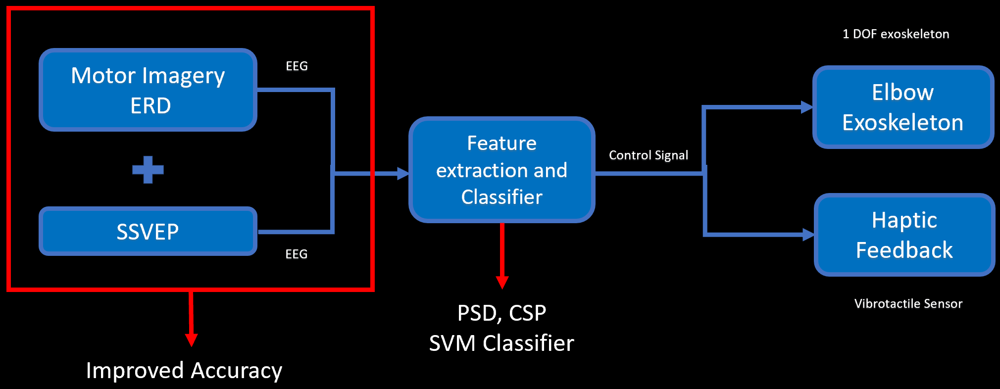
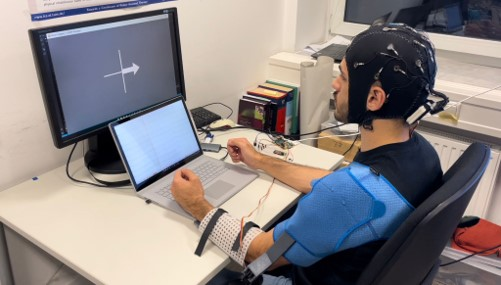
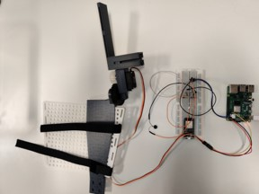
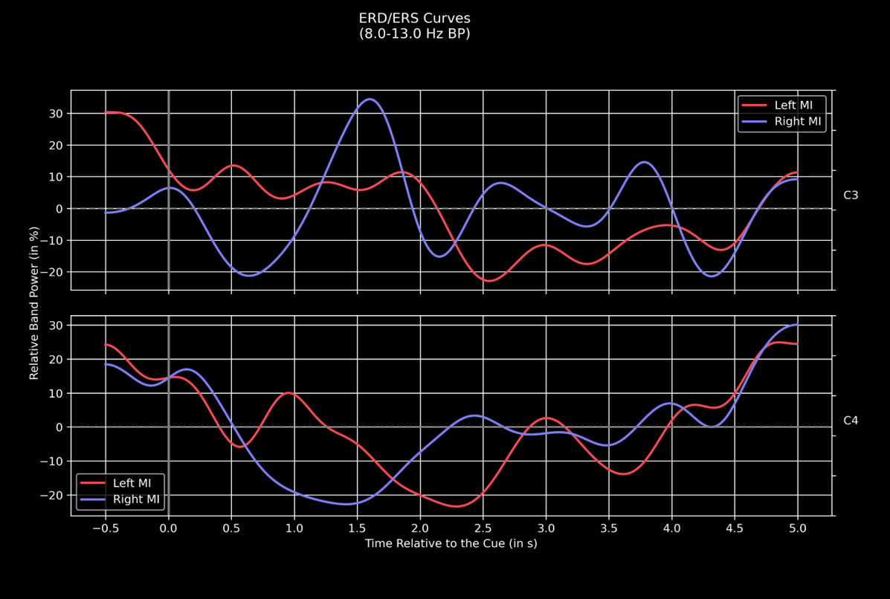
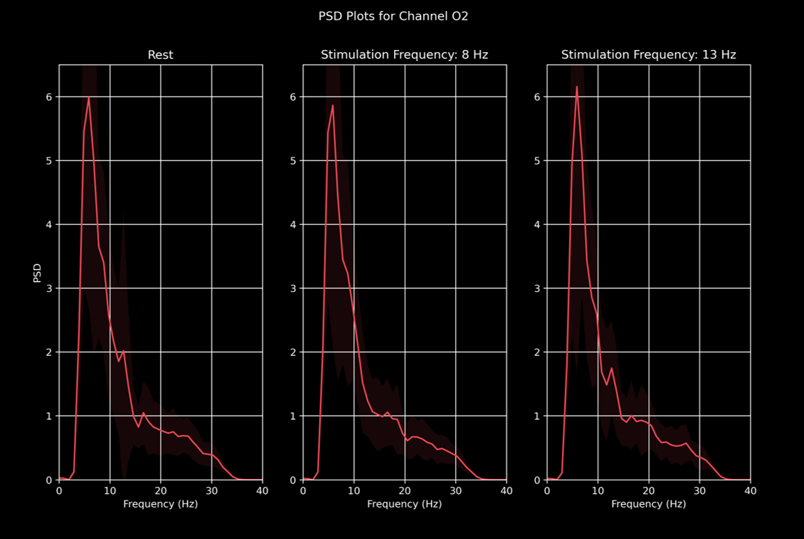
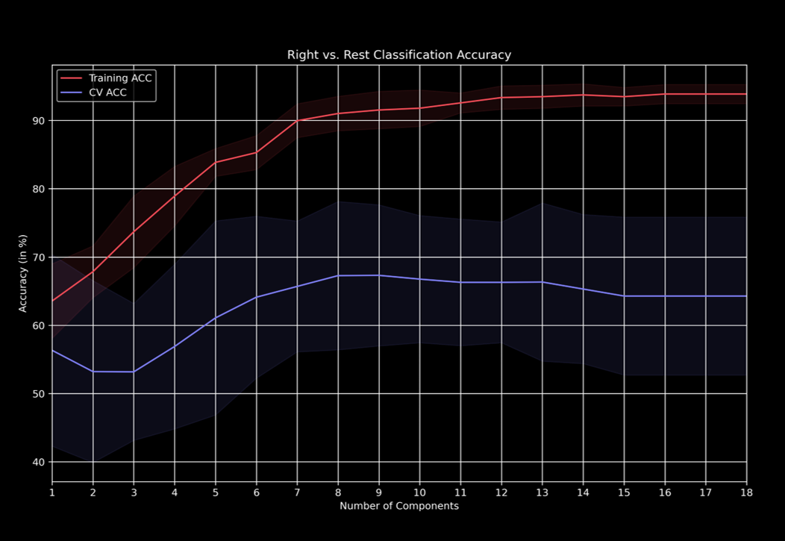

# NeuroTechX-Hackathon

Neuroexon presents a hybrid-BCI system that utilizes motor imagery (MI) and steady-state visual-evoked potential (SSVEP) to control a one degree of freedom arm exoskeleton which provides the user with haptic feedback.

## Table of Contents
- [Target Population](#target-population)
- [Aim](#aim)
- [Impact](#impact)
- [Hybrid BCI Pipeline](#hybrid-bci-pipeline)
- [Media](#media)
- [License](#license)

## Aim

This project was designed for stroke patients with muscle weakness. The aim was to enable rehabilitation using a hybrid BCI system coupled with an elbow exoskeleton equipped with haptic feedback. It offers multiple benefits compared to other technologies:

- More robust intention recognition from two information sources (MI and SSVEP).
- Improved neurorehabilitation experience for patients thanks to the haptic feedback.
- Portable system for rehabilitation at home.

## Hybrid BCI Pipeline

The hybrid BCI system combines motor imagery (MI) and steady-state visual-evoked potential (SSVEP) to achieve precise control over the one degree of freedom arm exoskeleton. It also provides haptic feedback to the user about the exoskeleton's position for neurorehabilitative effects.

## Media

- **Full system setup:** The participant is wearing the Smarting 24 EEG cap and the one DoF arm exoskeleton. The paradigm to record simultaneous MI and SSVEP signals can be seen on the screen. The arrow shows the participant the arm to imagine moving and it flashes with preset frequencies to evoke SSVEP.

  

- **Exoskeleton connected to the Arduino:** The exoskeleton and vibrotactile feedback connected to an Arduino, which is an integral part of our hybrid BCI system.

  

- **ERD/ERS curves acquired from Motor Imagery (MI):** Event-related desynchronization (ERD) and event-related synchronization (ERS) curves acquired from motor imagery tasks for two different electrodes.

  

- **Power spectral density (PSD) plot of SSVEP responses:** Power spectral density of the channel O2 resulting from flashing stimuli with different frequencies. As it can be seen in the third subplot, the flashing light stimulus evokes a response at 13 Hz.

  

- **Training and CV accuracies for Motor Imagery (MI):** Accuracy of our model during training and cross-validation for increasing number of principle components.

  

## License

This project is licensed under the [GNU General Public License v3.0](LICENSE).

---
Neuroexon - Empowering Neurorehabilitation through Technology
